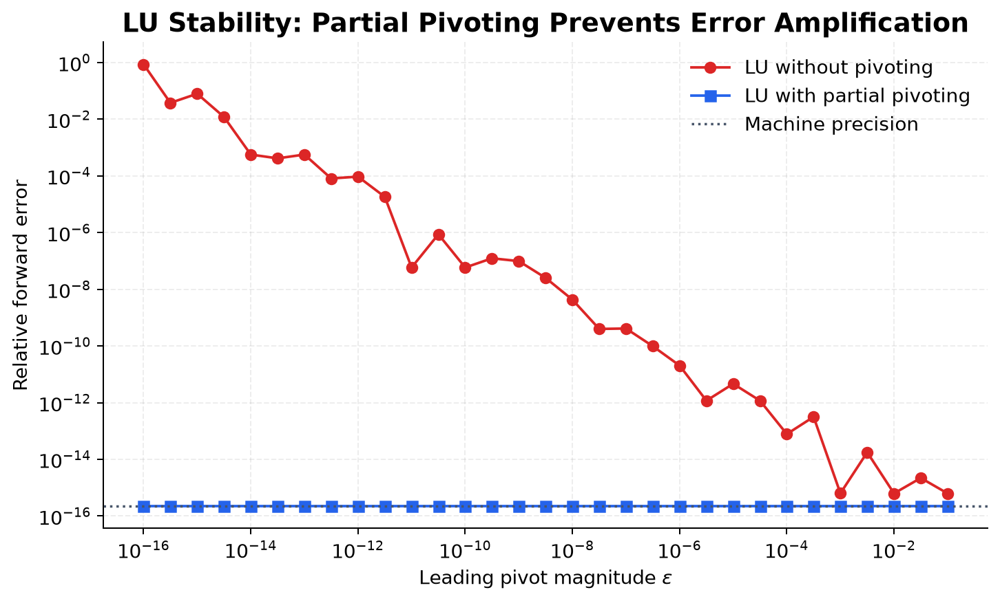
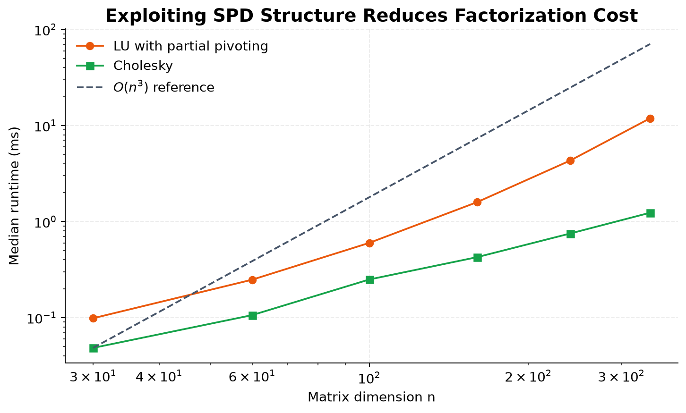
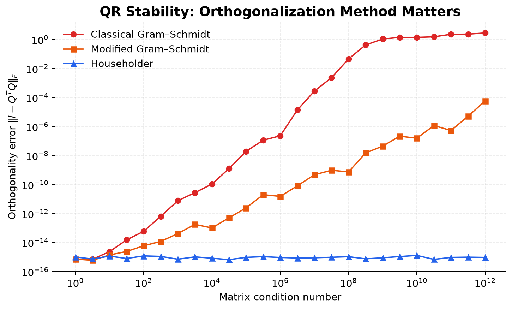
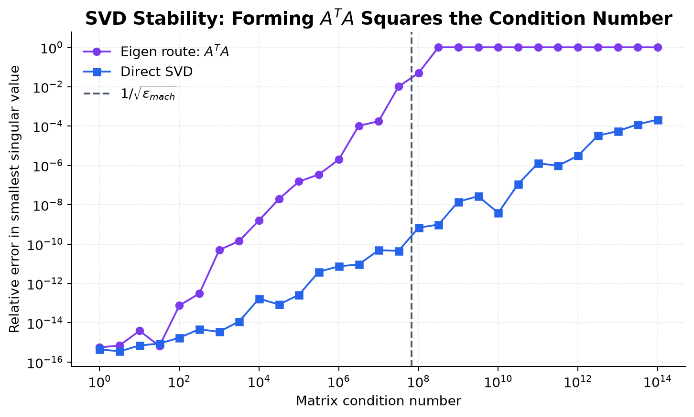

# Numerical Linear Algebra: Stability, Conditioning, and Matrix Factorization Experiments

This project investigates the numerical stability and computational behavior of fundamental matrix factorization algorithms. From-scratch implementations are used to study how pivoting, conditioning, orthogonalization methods, and normal-equation formulations affect numerical accuracy.

Rather than presenting matrix decompositions as isolated formulas, the repository treats LU, Cholesky, QR, least-squares, and SVD algorithms as controlled computational experiments. Every method is evaluated through residuals, forward errors, orthogonality loss, runtime scaling, or sensitivity to ill-conditioning.

## Core Experimental Results

<table>
  <tr>
    <td width="50%">
      
      <br><sub><b>Pivoting:</b> partial pivoting prevents a small leading pivot from amplifying rounding error.</sub>
    </td>
    <td width="50%">
      
      <br><sub><b>Structure:</b> Cholesky exploits symmetry and positive definiteness to reduce factorization cost.</sub>
    </td>
  </tr>
  <tr>
    <td width="50%">
      
      <br><sub><b>Orthogonalization:</b> Householder QR retains near-machine-precision orthogonality as conditioning worsens.</sub>
    </td>
    <td width="50%">
      
      <br><sub><b>Conditioning:</b> forming A<sup>T</sup>A squares the condition number and damages the smallest singular values.</sub>
    </td>
  </tr>
</table>

## Questions Investigated

- How does partial pivoting change the forward and backward stability of LU factorization?
- When does exploiting symmetric positive-definite structure make Cholesky preferable to LU?
- How quickly do classical and modified Gram–Schmidt lose orthogonality as the condition number grows?
- Why are Householder transformations more stable for QR factorization and least-squares problems?
- How does the normal-equation formulation amplify conditioning problems?
- When does computing SVD through $A^TA$ lose numerical rank or small singular-value information?
- How do weighted least squares and ridge regularization alter estimation under heteroscedasticity and multicollinearity?

## Notebook Overview

| Notebook | Main topics | Applications and experiments |
| --- | --- | --- |
| [LU Decomposition](src/LU%20decomposition.ipynb) | Gaussian elimination, LU factorization, forward substitution, backward substitution | Solving linear systems, pivoting stability, empirical time complexity |
| [Cholesky Decomposition](src/Cholesky%20decomposition.ipynb) | Factorization of symmetric positive-definite matrices, triangular solves | Verification, solving $Ax=b$, explanation of why pivoting is unnecessary, comparison with LU |
| [Least Squares](src/Least%20Squares.ipynb) | Normal equations, Cholesky solution, ordinary least squares, weighted least squares, ridge regression | Regression datasets, residual analysis, model comparison, coefficient visualization |
| [QR Decomposition](src/QR%20decomposition.ipynb) | Classical Gram–Schmidt, modified Gram–Schmidt, Householder reflections | Factorization and orthogonality errors, QR least squares, stability comparison on ill-conditioned matrices |
| [SVD Decomposition](src/SVD%20decomposition.ipynb) | Singular values and vectors, eigendecomposition-based SVD, pseudoinverse | Rank detection, SVD least squares, low-rank approximation, PCA, condition-number experiments |

## Repository Structure

```text
NLA/
├── README.md
├── docs/
│   ├── figures/
│   │   ├── cholesky-lu-runtime.png
│   │   ├── lu-pivoting-stability.png
│   │   ├── qr-orthogonality-stability.png
│   │   └── svd-conditioning-stability.png
│   ├── formula.png
│   └── least_squares_practice_datasets.xlsx
├── scripts/
│   └── generate_readme_figures.py
└── src/
    ├── LU decomposition.ipynb
    ├── Cholesky decomposition.ipynb
    ├── Least Squares.ipynb
    ├── QR decomposition.ipynb
    └── SVD decomposition.ipynb
```

## Topics Covered

### 1. LU Decomposition

The LU notebook develops the factorization

$$A = LU$$

from Gaussian elimination. It implements the factorization and triangular-system solvers from scratch, verifies the result using a factorization residual, and demonstrates why pivoting matters for numerical stability. A timing experiment is also included to illustrate cubic computational complexity.

### 2. Cholesky Decomposition

For a symmetric positive-definite matrix, Cholesky factorization writes

$$A = LL^T.$$

The notebook checks the required matrix properties, constructs the lower-triangular factor, solves linear systems, and compares Cholesky with general LU factorization. It also explains why a positive-definite matrix does not require pivoting during Cholesky factorization.

### 3. Least-Squares Problems

For an overdetermined system $Ax \approx b$, the notebook begins with the normal equations

$$A^TAx = A^Tb$$

and solves them with Cholesky factorization. It then develops three regression models:

- ordinary least squares (OLS);
- weighted least squares (WLS) for observations with unequal variance;
- ridge regression with an $L_2$ penalty for multicollinearity and ill-conditioning.

The notebook loads the practice workbook from `docs/`, prints verification results, and visualizes fitted models, residuals, and coefficient behavior.

### 4. QR Decomposition

The QR notebook compares three ways of constructing

$$A = QR,$$

where the columns of $Q$ are orthonormal and $R$ is upper triangular:

- classical Gram–Schmidt;
- modified Gram–Schmidt;
- Householder reflections.

The implementations are tested using both the relative factorization residual and the orthogonality error. QR is then used to solve least-squares problems, followed by plots that show how the three methods behave as the matrix condition number increases.

### 5. Singular Value Decomposition

The SVD notebook studies

$$A = U\Sigma V^T.$$

It contains a from-scratch implementation based on the eigenvalue decomposition of $A^TA$, together with reconstruction and orthogonality checks. Later sections use a numerically reliable direct SVD for practical computations, including:

- numerical-rank detection;
- the Moore–Penrose pseudoinverse;
- minimum-norm least-squares solutions;
- optimal rank-$k$ approximation;
- singular-value spectrum and cumulative-energy plots;
- principal component analysis (PCA);
- stability and running-time comparisons.

The final experiment demonstrates an important numerical fact: forming $A^TA$ squares the condition number, so the eigendecomposition-based method loses accuracy in the smallest singular directions earlier than a direct SVD algorithm.

## Practice Dataset

[least_squares_practice_datasets.xlsx](docs/least_squares_practice_datasets.xlsx) contains the following worksheets:

| Worksheet | Purpose |
| --- | --- |
| `README` | Description of the workbook |
| `Linear Regression` | One-feature OLS practice data |
| `Polynomial Regression` | Raw and scaled features for polynomial fitting |
| `Weighted LS` | Heteroscedastic observations with known standard deviations and weights |
| `Ridge Regression` | Correlated predictors for studying multicollinearity and $L_2$ regularization |

Run Jupyter from the repository root so the notebooks can resolve the relative path to this workbook.

## Requirements

The notebooks use Python 3 and the following packages:

- `numpy`
- `scipy`
- `pandas`
- `matplotlib`
- `openpyxl`
- `jupyterlab` or `notebook`

Python 3.10 or newer is recommended.

## Installation

Clone the repository:

```bash
git clone https://github.com/winmpkid/NLA.git
cd NLA
```

Create and activate a virtual environment:

```bash
python3 -m venv .venv
source .venv/bin/activate
```

On Windows PowerShell, activate it with:

```powershell
.venv\Scripts\Activate.ps1
```

Install the dependencies:

```bash
python -m pip install --upgrade pip
python -m pip install numpy scipy pandas matplotlib openpyxl jupyterlab
```

Start JupyterLab:

```bash
jupyter lab
```

Alternatively, use the classic Notebook interface:

```bash
jupyter notebook
```

## Experiment Reproduction Order

The experiments build on one another most naturally in this order:

1. **LU decomposition** — elimination, triangular matrices, and linear-system solving.
2. **Cholesky decomposition** — using symmetry and positive definiteness for a faster factorization.
3. **Least squares** — applying factorizations to inconsistent and regression systems.
4. **QR decomposition** — orthogonal transformations and more stable least-squares solutions.
5. **SVD decomposition** — rank, pseudoinverses, ill-conditioning, low-rank models, and PCA.

For each notebook, run the cells from top to bottom. The primary outputs are the verification quantities and stability plots rather than the printed factors alone.

## Reproducing the README Figures

The four summary figures at the top of this README are generated from deterministic experiments that mirror the notebook implementations. After installing the dependencies, regenerate them from the repository root with:

```bash
python scripts/generate_readme_figures.py
```

The script writes the PNG files to `docs/figures/`. Runtime values may vary by machine, but the qualitative trends should remain consistent.

## Numerical Verification

The notebooks repeatedly use the following checks:

- **relative factorization residual**

  $$\frac{\lVert A-\widehat{A}\rVert_F}{\lVert A\rVert_F};$$

- **orthogonality error**

  $$\lVert Q^TQ-I\rVert_F;$$

- **linear-system residual**

  $$\lVert Ax-b\rVert_2;$$

- **least-squares residual**

  $$\lVert Ax^*-b\rVert_2.$$

For a well-conditioned example, errors close to machine precision (approximately $10^{-15}$ in double precision) usually indicate that the implementation is working correctly. Larger errors are not automatically bugs: they may reveal ill-conditioning or instability in the algorithm being studied.

## Notes

- The from-scratch implementations are designed for controlled numerical experiments and algorithm comparison, not as replacements for optimized numerical libraries.
- Production code should generally prefer routines such as `numpy.linalg.solve`, `numpy.linalg.qr`, `numpy.linalg.svd`, and the corresponding SciPy functions.
- Singular vectors and QR column signs are not unique. Two valid factorizations may therefore contain columns with opposite signs while reconstructing the same matrix.
- Notebook plots may vary slightly across platforms because of differences in package versions and floating-point libraries.

## License

No license has been added yet. Unless a license is provided, the repository should be treated as source-available for viewing rather than as granting general reuse rights.
